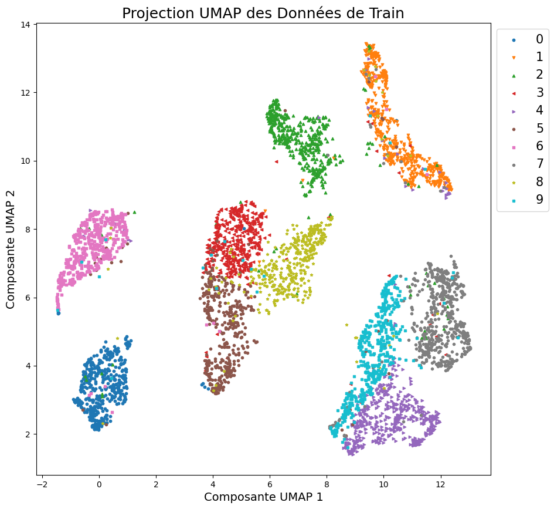
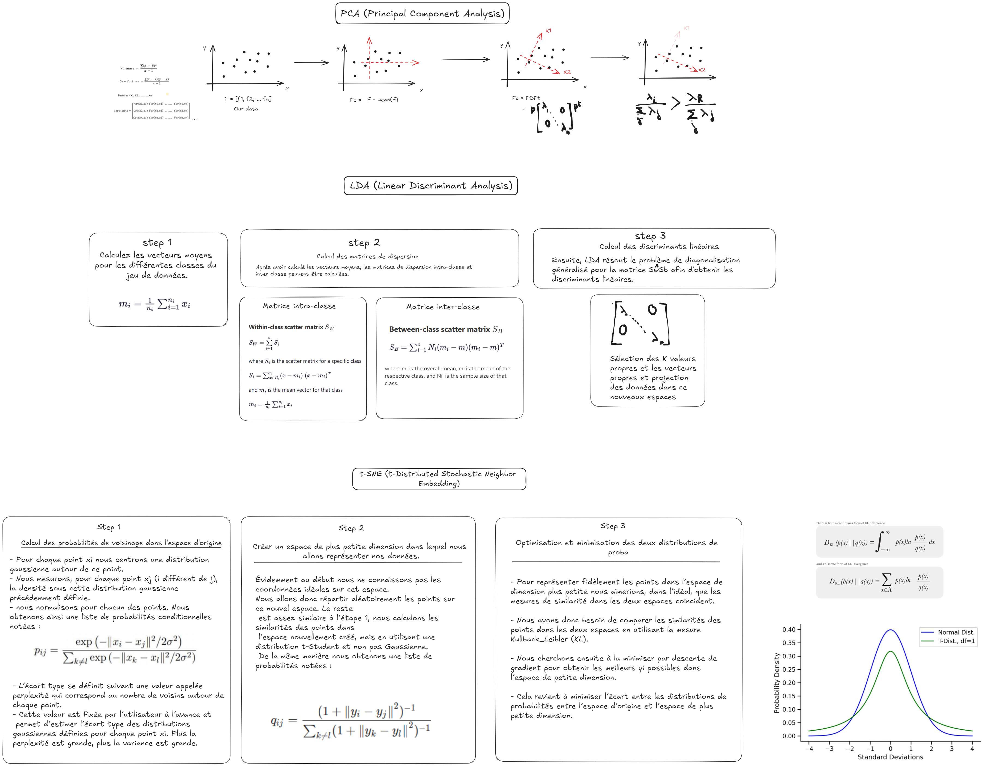

## PCA vs LDA vs t-SNE vs UMAP on MNIST

Ce projet a pour objectif de visualiser les différences entre les algorithmes de réduction de dimension les plus populaires : 

- **PCA** (Principal Component Analysis)
- **LDA** (Linear Discriminant Analysis)
- **t-SNE** (t-Distributed Stochastic Neighbor Embedding)
- **UMAP** (Uniform Manifold Approximation and Projection)

Voici les résultats de ces algorithmes appliqués sur le jeu de données MNIST :

### Comparaison des visualisations 

<div style="display: flex; justify-content: space-around; align-items: center;">
    <div>
        
        <p style="text-align: center;">PCA</p>
    </div>
    <div>
        
        <p style="text-align: center;">LDA</p>
    </div>
    <div>
        
        <p style="text-align: center;">t-SNE</p>
    </div>
    <div>
        
        <p style="text-align: center;">UMAP</p>
    </div>
</div>


Voici un tableau récapitulant les avantages et inconvénients des quatre algorithmes de réduction de dimensions : **PCA**, **LDA**, **t-SNE**, et **UMAP**.

| **Algorithme** | **Avantages** | **Inconvénients** |
|----------------|---------------|-------------------|
| **PCA (Principal Component Analysis)** | - Rapide à calculer même avec de grands ensembles de données. <br> - Utilisé pour des données continues et ordonnées. <br> - Facile à interpréter, les composantes principales sont des combinaisons linéaires des variables originales. | - Se base sur une hypothèse de linéarité, il ne capte pas bien les relations non linéaires. <br> - Sensible aux échelles des données, nécessite une normalisation préalable. <br> - Pas adapté pour la classification supervisée. |
| **LDA (Linear Discriminant Analysis)** | - Très performant pour des problèmes de classification supervisée. <br> - Maximise la séparabilité des classes tout en réduisant la dimensionnalité. <br> - Peut gérer plusieurs classes. | - Suppose que les données suivent une distribution normale dans chaque classe. <br> - Ne fonctionne pas bien si les classes ne sont pas linéairement séparables. <br> - Nécessite un nombre de classes inférieur au nombre de dimensions d'entrée. |
| **t-SNE (t-Distributed Stochastic Neighbor Embedding)** | - Très efficace pour capturer les relations locales entre les points de données. <br> - Très utilisé pour la visualisation dans des espaces à 2 ou 3 dimensions. <br> - Gère les relations non linéaires dans les données. | - Coût computationnel élevé, ce qui le rend moins adapté pour les grandes bases de données. <br> - Sensible aux hyperparamètres (perplexité). <br> - Les distances globales ne sont pas bien préservées. |
| **UMAP (Uniform Manifold Approximation and Projection)** | - Très rapide même sur des ensembles de données volumineux. <br> - Préserve mieux les structures locales et globales comparé à t-SNE. <br> - Gère aussi bien les relations non linéaires. | - Sensible aux paramètres d'initialisation. <br> - Les résultats peuvent varier avec des ensembles de données différents. <br> - Nécessite un ajustement minutieux des hyperparamètres pour des résultats optimaux. |

### Remarques :
- **PCA** est souvent utilisé comme première approche pour réduire la dimensionnalité, mais ses limites apparaissent dans les cas où les relations non linéaires sont importantes.
- **LDA** est idéal pour les problèmes de classification supervisée, mais nécessite certaines hypothèses sur la distribution des données.
- **t-SNE** est principalement utilisé pour la visualisation et excelle dans la capture des relations locales, bien qu'il soit gourmand en ressources.
- **UMAP** est plus rapide et peut préserver à la fois les structures locales et globales, mais nécessite un bon réglage des paramètres pour donner de bons résultats.

### Résumé des étapes de chaque algorithme




# Activer l'environnement

```bash
python -m venv .venv
\.venv\Scripts\activate # sur windows
```

```bash
source .venv/bin/activate  # Sur Linux/MacOS
```

# Installation des librairies

```bash
pip install -r requirements.txt
```

# Licence

MIT

# Author

Tariq CHELLALI

# Citations

https://www.kaggle.com/code/ohseokkim/the-curse-of-dimensionality-dimension-reduction/notebook#UMAP-connectivity-plot
